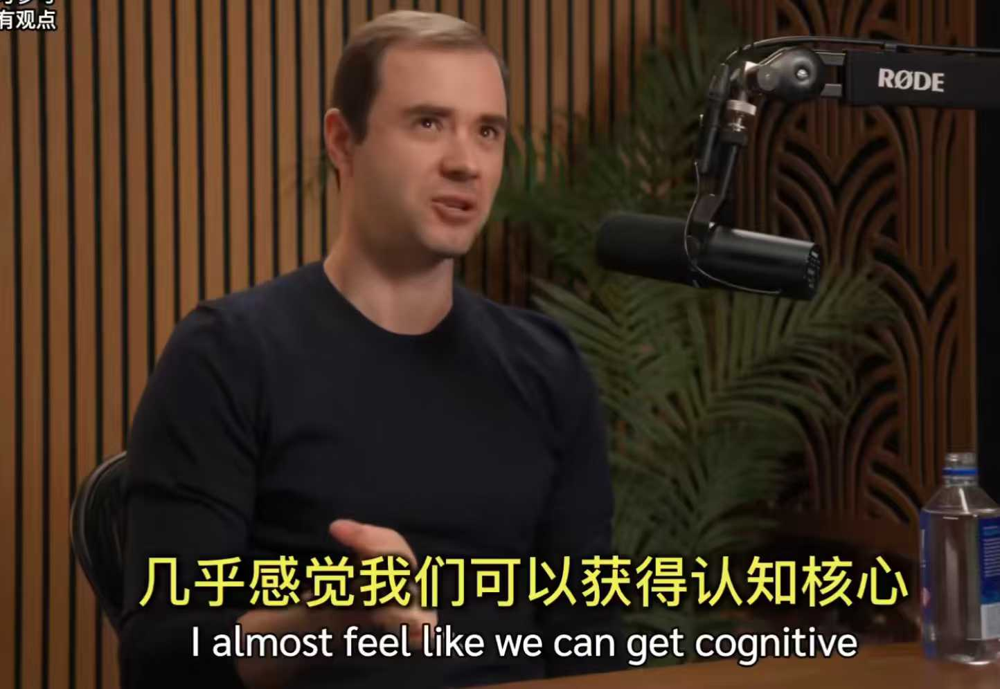
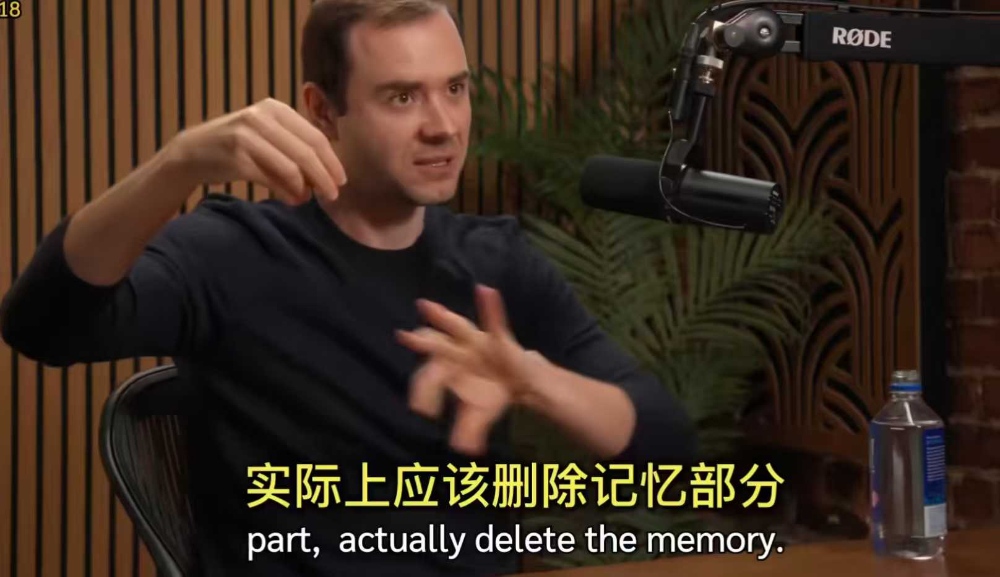

### **2025年AI技术全景复盘：从算力铁律的终结，到“认知核心”架构的黎明**

------

如果说自22年底大模型浪潮彻底爆发以来，哪一年AI技术发展得最快？那一定是2025年。今年的发展速度太快了。

回顾这一年：

- **年初**：DeepSeek 彻底引爆了 GRPO 和 RLVR 的训练算法与范式，从而引发了国内各大公司大模型本地部署的热潮，以及持续全年并将在 2026 年继续的 Agentic RL 产业与学术科研热潮。这衍生出了 DAPO、GSPO 等一系列方法，继 OpenAI o1 之后，引导业界向“带 CoT 的慢思考推理模型”这一路线转变。
- **3月**：应用层迎来巨变。MCP 协议爆火，OpenAI 开源 Agent SDK 杀入应用层；谷歌发布 Gemini 2.5 系列，能力开始质变，打响了 AI 时代的反击号角；Manus 营销的成功引发 Agent 竞争加剧；Claude 3.7 Sonnet 出色的 Coding 能力使得 Cursor、Trae、Augment 等 AI 编辑器开始大规模进入大众视野。
- **4月**：谷歌提出 A2A 协议，试图争夺 Agent 开发的协议基准制定权。
- **4月底-5月初**：Qwen3 模型以全模态、全参数开源策略和高质量性能，进一步抢占开源生态和市场，并陆续开源各种模型，日益成为开源界、学术界和产业界部署的 GOAT，巩固了这一地位。
- **5月**：Claude 发布 4 系列模型，进一步巩固了在编程领域的首选地位。
- **6月**：Meta CEO 扎克伯格斥资 1 亿美元高价挖人；Claude Code 推出革命性的命令行 AI Coding Agent。
- **8月-9月**：GPT-5 发布，Claude 4.1 系列发布，谷歌世界模型 Genie 3 发布。9月 Claude 4.5 系列发布。美国资本市场加剧了 "All in AI" 的趋势：英伟达、Oracle 与 OpenAI 签署涉及数千亿美元的循环投资协议；OpenAI 更是抛出未来几年 1.5 万亿美元的数据中心建设计划；Sora 2 的 AI 视频开始爆火。
- **11月**：GPT-5.1 发布，Google Gemini 3 发布并展示了自研 TPU 的潜力。Google 这种巨头把 AI 玩到了软件和硬件“两头硬”的视角上，是非常可怕的。
- **12月**：DeepSeek 发布 v3.2 正式版，使用了自研的新算法 DSA（稀疏注意力机制）；Gemini 3 Flash 发布，在速度飞快的同时，性能在某些领域竟然超越了 2.5 Pro。

基于上述观察，我们可以总结出以下几点趋势：

1. 大模型已向推理优化和微调方向转变。

这不难理解，单纯的大模型训练未来只能是少数巨头的游戏。即使 DeepSeek 发明再多新算法，也无法打破这一事实。理由很简单，有两点规律是死的：

- **第一，自回归机制的局限。** 大模型本身的机制是自回归的因果逻辑预测，概率预测精度永远不可能达到 100%。这点看似微不足道的误差，经过不断自回归预测，会导致错误呈指数级放大。为了提高整体性能，必须极致优化概率精度，而这需要庞大的、多样的高质量数据集。
- **第二，隐式建模的代价。** LLM 作为生成派，对世界完全是隐式建模。世界的规律、知识以及各种噪声混在一起，模型不只是对知识的压缩，为了拟合规律，还需要更多的参数。举个例子，重力加速度在现实中就是一条物理定律，但大模型为了拟合这一个又一个规律，完全隐式建模必定导致参数量暴增。

总结一下逻辑线路就是：

① Transformer 自回归预测会累积、放大误差 -> 大厂被迫卷 99.99% 的精度 -> 需要大量高质量数据 -> "数据量铁律"导致 AI 变成重资产游戏。

② 因为生成派完全是隐式建模 -> 为了拟合显式规律需要更多参数 -> 模型规模扩大 -> "参数量铁律"导致 AI 变成重资产游戏。

而“数据量铁律”和“参数量铁律”本质上就是算力铁律。

很多人问，为什么 DeepSeek 的新算法没打破这些铁律？因为他使用的还是纯 Model-free RL，完全通过暴力搜索。看似不需提前准备数据，但其实是“暴力搜索 + RLVR”在“制作”数据，性能虽有长进，但效率反而更低了。其次，这种方法不具备扩展性，RLVR 只能用于可验证领域（如数学、代码），对于人文科学等开放性领域存在局限。

至于 MoE 架构，它只是在推理侧选择性激活权重，但为了隐式建模整个世界，仍需要大几百 B 的总参数量。它们的贡献在于用算法降低了训练侧成本，但由于铁律限制，模型训练普及化仍遥不可及。且由于错误累积效应，巨头们不断往 99.99% 的目标卷，普通厂商在没有数据、算力和大参数量承载隐式世界的情况下，拿什么竞争？

**2. 应用层下半场爆发。** 基于第一点的分析，这点已成必然。

**3. 世界模型理论将是未来。** 纯生成派的上限虽然 OK，但那意味着雄厚的财力。要把预测精度卷到 99.99%，巨头的资源可能都不够。所以未来，必须要把**规律**和**知识**两者分离。现在的大模型为了兼顾两者，浪费了大量的参数量去隐式建模。

------

**我的假设与架构猜想**

未来应该像 Andrej Karpathy 在播客中说的那样，存在一个小参数的 **Cognitive Core（认知核心）**。

这个 Core 直接建模规律和第一性原理。然后对知识内容本身进行压缩，单独训练一个 Model。认知核心吸收用户的输入，转化为出发自第一性原理的输出，再把这个输出作为“知识内容压缩模型”的输入。检索到相关信息后，可以直接训练压缩模型整合规律和知识的能力；也可以训练第三个模型，让第二个模型纯粹扮演 RAG 的角色，由第三个模型承担规律和知识的整合输出。

这种方式通过分离规律和知识，大大降低了模型在数据中隐式建模规律所需要的参数。未来我也将在这一设想上进一步实践、研究。

需要注意的是，Cognitive Core 怎么训练？我现在的想法是，可以把许多问题作为输入，将回答变为纯 Python 代码块或者伪代码块，去训练一个小参数 Model。

举个全流程的例子：

**User**：分析一下红楼梦里林黛玉为什么死？

**Cognitive Core** (输出逻辑代码):

```python
def analyze_death(person="Lin Daiyu"):
   reason_1 = knowledge_db.search("Lin Daiyu health condition") # 身体原因
   reason_2 = knowledge_db.search("Lin Daiyu psychological state") # 心理原因
   reason_3 = relation_graph.query("Lin Daiyu", "Jia Baoyu", "marriage_failure") # 外部导火索
   final_conclusion = synthesize(reason_1, reason_2, reason_3)
   return final_conclusion
```

**Compression Model** (肚子里装满了《红楼梦》原文、医学常识、心理学知识):

- 看到 `search("health")` -> 它的隐式记忆立马调出“肺结核、体弱多病”。
- 看到 `synthesize` -> 它立马想出相关的词汇“对比分析法”“异同分析法”等。

**Integration Model** (输入为 Cognitive Core 和 Compression Model 的输出):

- 输出：一篇有理有据、文采飞扬的文章。

世界模型理论通过分离仿真、生成和认知，使得纯粹将三者合并到一起的隐式建模生成派所面临的大参数量和大规模数据问题，有希望得到解决。

最后的最后，这是我对世界模型如何构建 AGI 设想上的一个统一建模公式（该公式未来可能会随着 AI 的发展和我在实践中认知的变化而改变）：







