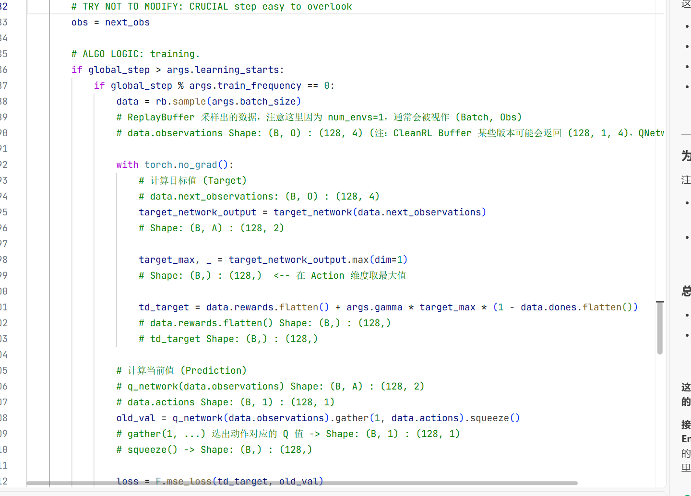
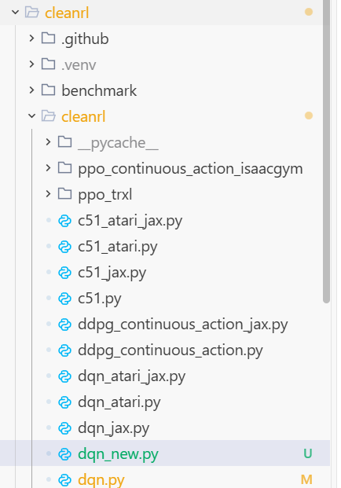
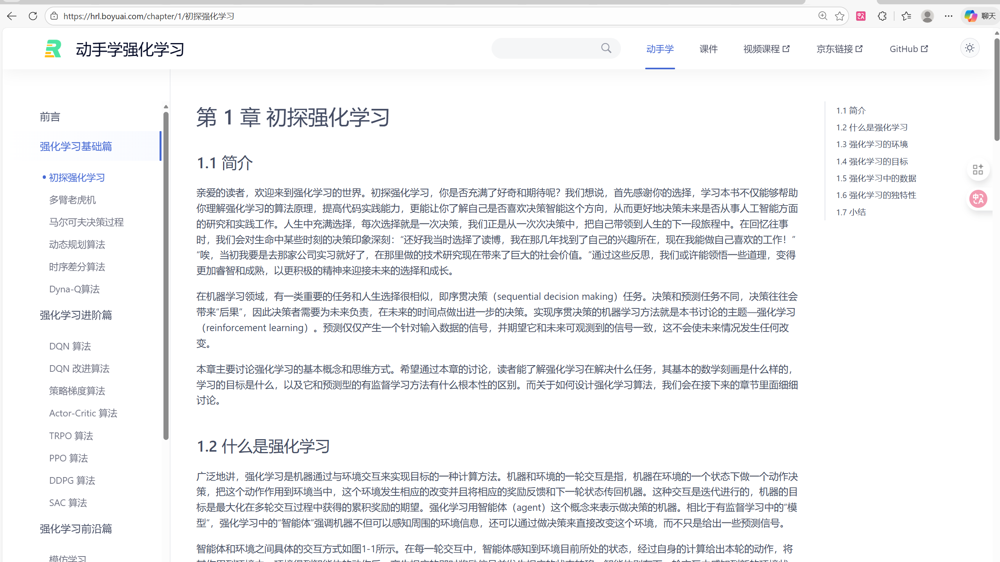
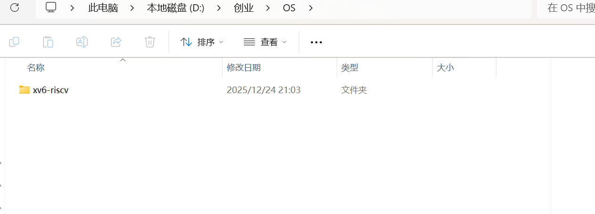
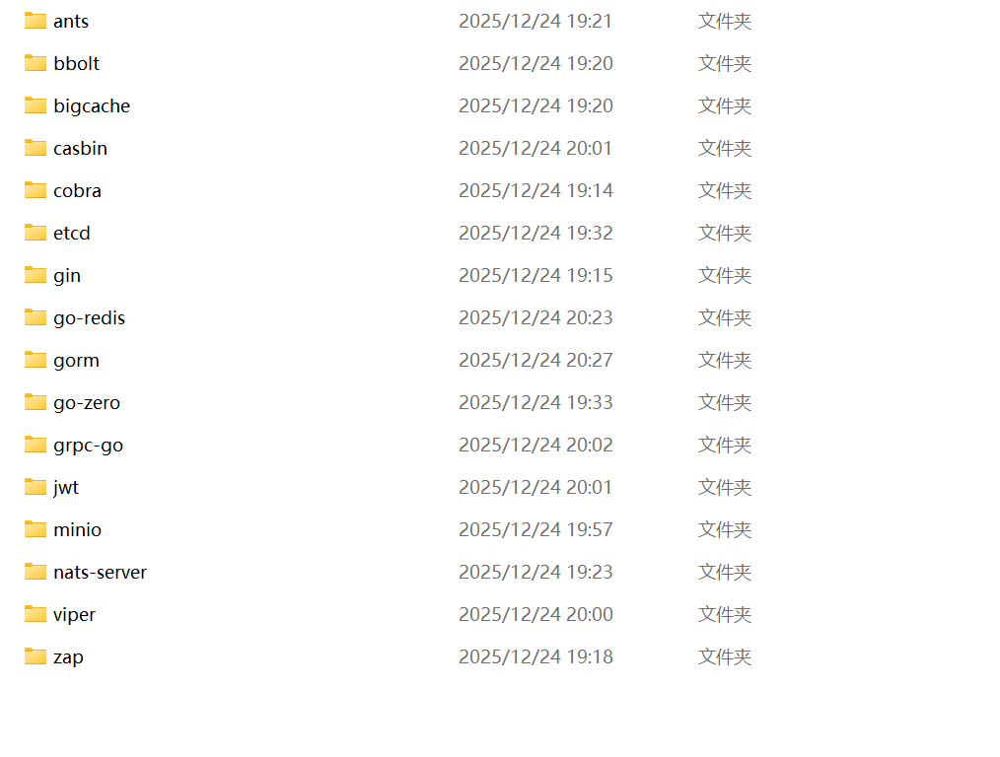

学长对AI的理解好深入哇，平时会看哪些公众号嘞

---

我：哈哈哈其实我平常看公众号就是刷到哪个看哪个，没有太关注是哪个公众号

如果你也想学得比较深刻，我可以给你几个建议

---

好滴好滴

---

最重要的是

读源码

你会发现计算机和AI的世界

知识获取其实是廉价的

这是最最最好的事情

因为其他学科的好东西不一定会放出来

---

确实

---

但是计算机世界的好东西可真就是开源的

所以一定要去github上把源码拉下来

现在有AI了

不懂的一行一行问AI

可以下一个cursor或者trae

trae的话，新号一个月就21

而且不充钱的话，现在免费可以无限用gemini 3 flash

----

还是不能想着吃饭的时候刷刷就能了解多少[捂脸]

---

这个又快又好，不会的直接问它就足够学习用了

挺好的啊，吃饭的时候刷刷积少成多也很重要

吃饭的时候可以刷刷宏观的东西

我继续说哈

---

OK

---

所以说，最顶级的代码已经展现在你面前了，完全没必要报什么课

不要听课学

这个方式已经落后了

效率不够高

你看AI世界的划分

最传统的机器学习ml

然后是神经网络，就是深度学习dl

然后是强化学习rl

然后神经网络里效果最牛逼的，就是transformers架构，把它扩大到几百亿参数，就是大模型了

大模型因为惊人的泛化能力，使得可以利用大模型开发AI应用，使用AI进行应用的开发就是ai agent领域的事

所以基本上就是ml,dl,rl,llm,ai agent这五大江山

然后今年

world model的概念正式才开始被一些人知道了

所以未来一定world model是第6江山

因为他理论确实不错

结合我刚才说的方式

AI的学习和普通前后端不一样

普通前后端，可能你就啃开源的顶尖项目就好了

但是AI，你不仅得啃项目，还要读论文

所以你在AI时代的学习AI的方法应该是

比如，我要学ML，那我去github上找别人实现的ML框架，如果不清楚，问AI最牛逼的框架项目是什么，最后你大概率就会找到scikit-learn这个框架

然后把这个框架拉取下来

然后开始啃源码，不会的一律问AI

读到一个算法

觉得自己不懂他的数学原理

去找他最开始诞生的论文+框架代码+AI结合着学

注意ML已经其实不是工业界常用的做法了

所以不要浪费太多时间在ML上

基本上，会下面这些就行了，而且大三机器学习也是必修课

所以不用花过多精力在这

---

可以可以[加油]

之前GitHub 还看不进去，这学期扎实学了数据结构过后好一点了

---

你就看看线性回归，逻辑回归，明白监督学习里的回归和分类两大类问题就OK，然后无监督学习你就看看K-means聚类算法和PCA主成分分析算法就oK，就明白了无监督学习里的聚类和降维两大类问题

【引用：之前GitHub 还看不进去，这学期扎实学了数据结构过后好一点了】结合着AI编辑器看

也就是说机器学习基本上你就把这四个算法搞清楚

就可以过了

大三还会讲一些其他的算法

那个时候专业课再学其他的

然后DL

我建议是你直接读DL的论文

你可以找一本dl的书

看看他的目录

然后每种算法或者思想模块，都有论文

找出来结合AI把数学原理弄明白

BP算法很重要

就是反向传播

这个算法数学原理一定要清楚，也是DL上来最难的一个算法

这个算法机器学习大三你们也会学

然后其实你会了DL数学原理后，DL的代码pytorch已经封装的特别特别好了

基本就是我想要个什么样的层，就写一行代码

罗列出来

就没啥得了

pytorch的源码其实很重要

但是非常难啃

我不建议直接啃

这个pytorch的源码我建议是后期再啃

你弄懂数学原理后

代码什么的DL真的不难，交给AI都可以，见得多了自然就能会了

dl代码唯一比较恶心的就是张量形状在代码里各种变换

---

自己今年寒假积极行动起来[加油]

---

加油加油

【引用：dl代码唯一比较恶心的就是张量形状在代码里各种变换】但是，我的建议是

AI时代了

不要刻意去记忆那些形状变换的接口

在数学上搞懂他

然后你可以用一种工程化的规约解决这个问题

我举个例子

因为形状变换本身数学上就不难

但是工程上容易搞晕

所以就可以交给AI

因为工程上也不难

只是各种接口，变换

记着难受

---

嗯

---



换个颜色

你可以直接先写注释

说我想让形状这么变

然后让他帮你补充接口

用这个问题就可以解决复杂接口的记忆

所以说不要怕接口忘记了

文档可以随时查

AI可以随时填

刨除记忆，理解本质

---

确实，人脑同时只能记忆部分内容

---

记忆不值钱了

直接外挂给LLM

但是理解他很重要

知道有这些接口

是用来干这个的

很重要

所以要快速过

听课的时候

现在课都在讲

接口怎么怎么记忆一大堆

其实没用了

---

了解了解

---

大概意思就是给AI定义好

(B,N,O)等等

这些符号什么意思

---

没事没事，我现在也还没入门

---

然后直接用这个注释

嗯呢

---

学长点播一下，我先有了印象

---

就举个例子

```python
def forward(self, x):
        # x Shape: (B, N, O) : (128, 1, 4)  <-- 如果是 batch 训练
        # x Shape: (N, O)    : (1, 4)      <-- 如果是采集数据
        return self.network(x)
        # Out Shape: (..., A) : (..., 2)
```

这个函数

你看这个注释

输入的情况

输出的情况

标清楚


这种如果你不会写

比如那个flatten

但是你告诉AI

输入的形状和输出的形状

AI就会自己补上去

那个接口

你大概懂我意思了吧

---

懂嘞

---

OK

然后DL就差不多这样

基本上DL比较重数学逻辑

懂逻辑之后

代码什么的算简单的

先不用啃DL的pytorch整体的源码

会用就行，怎么用就是我说的，你明白数学了，DL代码因为简单，你就不停写规约和注释

直接让AI给你填充

然后你要读懂

这个很重要

你可以不写

但是AI写了

你要读懂

慢慢你就会了

不会的再问它

因为DL代码本身不是工程意义上的难，都封装的很高级了

然后DL你就把MLP,CNN会了

RNN和LSTM这两个，花半天时间把数学原理搞懂

也不用记忆这两个架构到底如何如何

理解他的思想本质就是让神经网络去模拟各种你赋予他的角色就OK了

因为RNN和LSTM已经基本被transformer替代了

transformer的数学原理要好好读论文

这里面有一个著名的论文

attention is all you need

就是注意力机制

然后数学你搞明白了，pytorch会调用就行

你就把神经网络的输入和输出能干啥记住

数学原理搞明白

---

嗯嗯

---

然后不用刻意记忆RNN和LSTM的架构，感受架构的思想

MLP,CNN,transformer这些的架构还是要记记

记忆顶多辅助理解

但是这些架构本身简单的很

不难记

对，理解是关键

记忆重要的是，你知道什么东西能干啥

就OK了

然后DL这关还有一些小的技巧

比如

批量归一化，dropout方法

把这几个小的优化技巧学学

在pytorch里就是封装好的几句代码

然后LLM

你看每个AI技术都有顶级的开源项目

LLM的话，怎么训出来的

最小原型

有个项目很火

karpathy大佬的开源项目

nanoGPT

你会了DL

再看这个项目就非常简单

然后你弄明白了LLM的原理后

你自己肯定训练不起

---

还好是有聊天记录的，不然要是面聊的话我可能好多都丢失印象了[捂脸]

---

这个要很大财力

哈哈哈

但是你可以训一个3B这种小参数的

玩玩

去租一个GPU服务器

autodl这个平台

不要用自己电脑训

即使你是有N卡的

然后服务器使用的话

都是命令行

你用cursor或者trae

SSH远程连接到你的服务器

就感觉是在本地写项目了

但是所有执行动作还是要最终通过命令行

所以你要学学

包管理器

pip conda uv

我的建议是pip就会几个常见的命令就行了，甚至其实就2,3个命令

uv兼容pip

直接前面加个uv就能使用

我现在一直在用uv

我觉得他非常好

比conda舒服

并行下载包很快

python的依赖管理我推荐你去学学uv

也没几个命令

---

OK

---

你记住一个python项目一个虚拟环境

千万不要多个项目公用一个

依赖会乱



你看我这个项目

就是.venv

虚拟环境

只给cleanrl这个项目用

---

放在这个文件目录下是吧

---

还有

对

项目根目录

这是标准做法

---

对

---

uv venv创建环境

uv的下载是pip install uv

然后把uv的exe那个路径放到环境变量里

就能全局使用uv了

你自己以后去了解了解

然后服务器你本地连接远程了

你想跑东西

你睡觉他也在跑

你不能直接点运行然后把你本地电脑关了

---

神奇

---

要不然服务器也会断

所以你应该学一下

nohup

screen

二者选其一

我经常用nohup

这个是linux命令行的一个命令

---

就是说跟云服务器一个原理还是，跟虚拟机一个原理呀[晕]

---

nohup command > xxx.log 2>&1 &

用这个命令

command就是你要持久化的东西

xx.log就是你要把输出放到这个日志路径里

---

嗯

---

[引用：就是说跟云服务器一个原理还是，跟虚拟机一个原理呀[晕]]这个和虚拟机没关系

虚拟机是你本地

虚拟了一个OS

服务器是你远程租别人的

服务器基本都是liinux

稳定

然后就是RL了

---

嗯，虚拟机实际上用本地资源怎么也跑不了模型

---

你不懂的让AI帮你输出命令

然后慢慢你自己也会了

是的

跑模型基本就是linux

依赖管理最好

windows狠多不兼容

但是比较小的网络如果你有N卡本地

也可以自己跑了

如果单纯pytorch的话

大型项目包多了

windows可能就不好了

但是学习啥的读源码可以本地

毕竟你租个GPU你还不跑训练

有点奢侈

哈哈

---

嗯

---

学习的时候没必要在服务器上连接学

跑的时候再租

嗯嗯

然后就是RL了

RL很重要啊

RL我觉得是让MODEL超越人类的关键技术

超越数据的技术

单纯靠ML,DL

超越不了人类数据水平

RL就可以

RL的话

RL的数学非常难

你要搞懂需要费一些功夫

看你数学功底了

我的建议是

不要一口气吃胖子

多来几遍

第一遍可能搞懂了

后面忘了

再来一遍

会有新的理解

然后也是

---

确实，数学上有时候慢即是快

---

先看论文

数学懂了

看代码

然后不会的一律AI问它

效率是最高的

还有就是

当你新入门一个领域

直接看它算法的论文

你可能会一下子难受

不知道在说啥

所以可以适当看看视频

但是后期

一旦入门

就不要看视频了

自己学

---

嗯嗯

---

这都是多遍的过程

然后RL的话



这个不错

还有西湖大学着老师B站的课

基本上

你到PPO

学完

就已经算是会RL了

后面SAC也很重要

前沿篇之前

都会了

RL你就可以说算是会了


这些你可以暂时搁置

大模型也可以通过RL训练

大模型训练过程是三步

预训练

指令微调

后训练

指令微调是SFT

后训练是RL

大模型后训练用的RL方法是PPO->GRPO(GSPO/DAPO)

gspo和DAPO都是GRPO基础上优化的

但是GRPO是最重要出名的

因为GRPO是专门训练大模型的RL算法

其他的rl算法不一定训大模型用的

训的都是小网络

---

了解

---

grpo就是ds的产出

ppo是openai2017年的产出

GSPO是阿里的

产出

DAPO是清华和字节的产出

都是大厂

所以你能看到说现在AI都是重资产游戏

产业界比学术界要厉害

因为学术界没那么多资本

---

是呀

---

然后RL的源码

我推荐你先读cleanrl

这个很轻量读起来很舒服

然后就是ai agent

这方面我可是老手了

AI AGENT是最近两年才兴起的技术

基本上包括这几个知识点

function calling(AI应用革命的核心和本质）->封装成协议MCP

提示词工程，最出名的和好用的是react

然后RAG

就是本地知识库检索

然后就是json结构化输出

这个是大模型和程序之间交互的格式

还有就是GRPO和SFT微调小模型

比较成熟的框架比如trl,unsloth

可以读读源码

还有就是vllm这个库

这个库推理大模型最快

因为他创新了一种机制

paged attention

这个基本是你如果想做AI infra岗位工程师必会的

vllm源码太多了，很多是为了优化写的很杂

可以找一些开源项目

实现vllm核心逻辑的

读读那个就行

---

当一个工程师是我的目标🎯

---

你可以瞄准AI infra

这个领域

这个领域的工程师现在是中美都最缺的人才

基本就是模型怎么推理加速，api服务怎么支持高并发

怎么部署大模型

怎么多机多卡微调或者训练

要求你既会算法

也会工程

所以吃香

然后AI Agent的学习其实基础概念就那么多

重要的是项目

多做一些有意思的不同领域的ai agent

比如voice agent

就是AI和你聊天

它顺便可以挂载工具

之类的

而且你可以随时打断它

怎么做到这个事

怎么让他响应延迟小

都是这个领域研究的事

你想想你现在问大模型

大模型都要思考半天

怎么做到让大模型回答延迟低于2s

这个就是一些工程和优化技巧了

需要特殊训练自己的小模型

上限才能拔上去

---

是呀

---

还有什么本地知识库

什么AI PPT AGENT

之类的

多做点肯定没坏处

然后就是world model了

---

学长你寝室在哪，我给你买点吃的喝的送过去，聊表感谢[呲牙]

---

去看谷歌genie和杨立昆的jepa系列模型的论文

不用不用哈啊哈我现在在图书馆嘞

改天吧

---

好吧

我刚从教室出来

----

噢噢噢噢

你什么时候

考完试

---

1月7号，考最后一场微积分

----

嗷嗷嗷

我是1.4还有一场

但是比较简单了这个课

---

妥

---

【引用：去看谷歌genie和杨立昆的jepa系列模型的论文】然后可以看看我发的帖子

你可能就能get到一些东西了

这个领域非常前言了

前沿

很多思想还在探索

当然了

一定有项目

dreamerv3-torch

这个项目已经实现了顶级世界模型的训练过程脚本

但是他这个世界模型

还没有接入仿真派

不过已经是业界最前沿的实现了

现在三派合一的世界模型就还没出现其实

但是是趋势

这一定是没爆发的下一个未来

贴切点来说

RL训练是好

但是太慢

效率太低

因为RL本质是大量暴力搜索

搜索到好答案

奖励多点

坏的惩罚多点

然后慢慢模型就往好的策略空间靠拢

暴力搜索对于大模型的亿万维度的空间来说

效率很低的

是SFT效率的1/10

差不多

但是SFT是监督学习过程

上限超不过人类

所以为了解决RL慢的问题

世界模型相当于提前做规划

我知道往那边探索结果大概率不好

我就不探索那了

这样聪明地探索

就解决了RL慢的问题

还能享受RL的效果

这就是world model

差不多就这些

AI world

---

那他得先知道怎么知道哪里探索结果可能好

---

所以SFT

SFT是先让模型接近最优空间

但是人产生的数据是人的智力边界

---

巧妙

---

去拟合人

就不会超越人

但是RL在这个次优的空间

探索

就能超越人

但即使SFT

大模型的空间维度太高了

RL也不好搜的那么容易

所以慢

所以才有世界模型

聪明地搜

有点类似于

模型探索前

先用世界模型做梦

预测各种路的情况

然后坏的路直接不探索了

世界模型经过训练，预测正确的准确率可以很高

这样相当于脑子里先幻想我走哪好

再引导RL往哪重点搜

就牛逼了

还是挺神奇的吧

---

未探索完全的海洋[强]

---







这些是我比较推荐的项目

我也在啃

哈哈

有一个是go语言

有一个是AI

有一个是MIT为了教学OS做的小型的操作系统的源码项目

这个是GO

这个是AI

---

可以可以，我寒假先从ml 学起来，按照你的建议一点一点来

---

嗯嗯

ML就4个算法就可以过了

别浪费太多时间在这个上面

---

嗯

---

已经不是产业界主流做法了

加油

---

加油加油